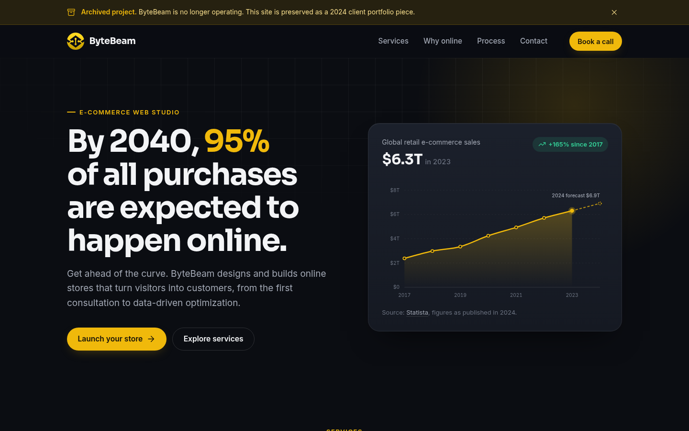

<h1 align="center">ByteBeam</h1>

A landing page built for my first client. He had experience building e-commerce stores on Shopify and WordPress but needed a custom landing page, so he reached out to me. His brief called for a clean, minimalist design with modern-looking charts, and that's what I delivered. He has since closed his business, so the site is no longer in use, but it remains part of my portfolio.

## Links

- [Repo](https://github.com/marinsabo/Byte-Beam "Byte-Beam Repo")
- [Live](https://marinsabo.github.io/Byte-Beam "Live View")

## Screenshots

## Built With

- HTML5
- CSS3
- JavaScript

## AI Usage

I used generative AI as a support tool in this project:

- finding and analyzing credible sources for e-commerce sales statistics
- drafting the page copy, which I then reviewed and edited
