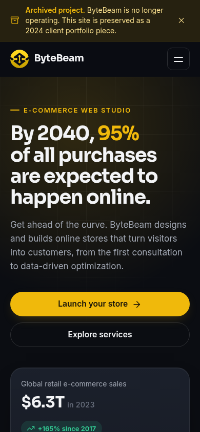
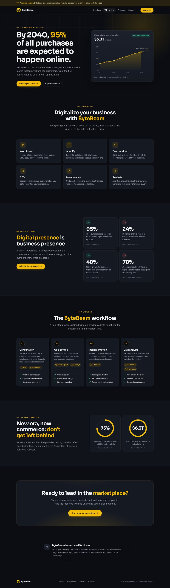

# ByteBeam

Landing page for **ByteBeam**, a small e-commerce web studio that built WordPress, Shopify and custom websites for local businesses.

ByteBeam was my first client project (2024). The business has since closed, so the site is kept here as an archived portfolio piece. It was redesigned in 2026 to current standards, keeping the original brand, structure and message.


<p align="center">
  
</p>

<details>
<summary>Full page</summary>



</details>

## Features

- **No build step.** Plain HTML, CSS and vanilla JavaScript.
- **Responsive.** Fluid type and spacing with `clamp()`, plus CSS Grid layouts that work from 320px phones up to wide desktops.
- **Graphics drawn in code.** The sales chart, progress rings and icons are inline SVG, so they stay sharp at any size and need no image downloads.
- **Accessible.** Semantic landmarks, a skip link, visible focus states, a labelled mobile menu (`aria-expanded`, closes on Escape), and text alternatives for the chart.
- **Gentle motion.** Scroll reveals, a chart that draws itself and count-up numbers, all using `IntersectionObserver`. All animation is turned off under `prefers-reduced-motion`, and every element stays visible when JavaScript is off.
- **Sourced stats.** Every statistic links to the source it came from.
- **Sharing metadata.** Meta description, Open Graph and Twitter card tags, a web manifest and favicons.

## Structure

```
.
├── index.html            # The whole page, plus an inline SVG icon sprite
├── assets/
│   ├── css/styles.css    # Design tokens, layout and components
│   ├── js/main.js        # Mobile nav, archive banner, scroll reveals, counters
│   ├── img/              # Logo (PNG + WebP) and Open Graph image
│   └── icons/            # Favicons and app icons
├── site.webmanifest
├── favicon.ico
└── docs/                 # README screenshots
```

## Run locally

Open `index.html` in a browser, or serve the folder:

```bash
python3 -m http.server 8000
```

Then visit <http://localhost:8000>.

## Deploy

The site is fully static, so it works with GitHub Pages as-is: in the repository go to **Settings → Pages**, set the source to **Deploy from a branch**, and choose `main` with the `/ (root)` folder.

## Credits

Design and development by **Marin Sabo**.
Statistics belong to the sources linked on the page (Statista, Zippia, BusinessDIT, FinancesOnline, Stanford Web Credibility Project).
